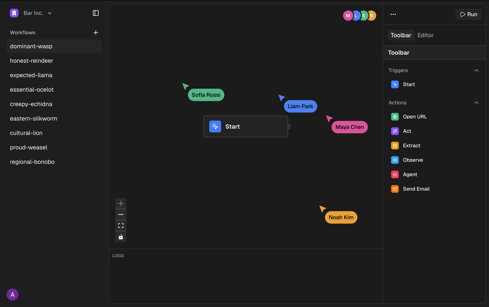
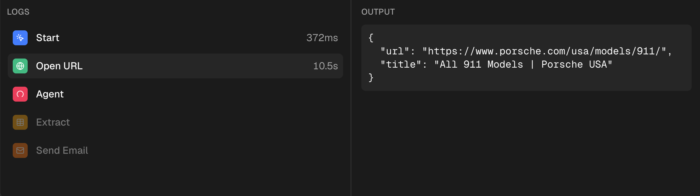
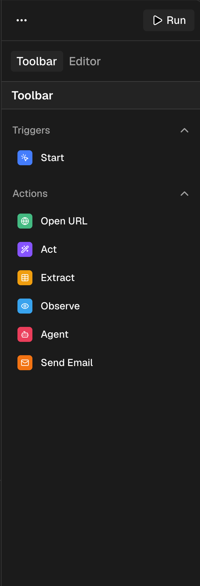

# Browser Automation Workflow Builder

A multi-tenant visual workflow editor for composing and running browser
automation. Workflows are edited collaboratively with React Flow and Liveblocks,
persisted to Neon Postgres through Drizzle, and executed as durable Trigger.dev
tasks using Stagehand on Browserbase.

The current package name is `next-app` and the repository is in active initial
development (`0.0.1`).

## Features

- Clerk authentication with organization-scoped workspaces
- Collaborative React Flow canvas with cursors and user presence
- Registry-driven Start, Open URL, Act, Extract, Observe, Agent, and Send Email
  nodes
- Upstream output interpolation with `{{ nodeId.path }}` tokens
- Graph validation and dependency-ordered execution
- Trigger.dev run status, cancellation, step timing, output, and error updates
- Browserbase/Stagehand browser sessions shared across browser nodes in a run
- Browserbase HLS session replay for Pro organizations
- Clerk Billing plan gates for the Agent node and session replay
- Resend email delivery
- Dark and light themes
- Standalone Next.js Docker image

## Screenshots

### Collaborative canvas



### Run output



### Node toolbar



Additional reference images are available in [`Design/`](Design/).

## Tech Stack

| Area | Implementation |
| --- | --- |
| Web application | Next.js 16.2.6 App Router, React 19.2.4, TypeScript |
| UI | Tailwind CSS 4, shadcn/ui, Base UI/Radix primitives, Lucide |
| Workflow canvas | React Flow 12.11.2 |
| Collaboration | Liveblocks 3.22.0 and `@liveblocks/react-flow` |
| Authentication and billing | Clerk 7.5.19 and Clerk Billing |
| Database | Neon Serverless Postgres, Drizzle ORM 0.45.2 |
| Background execution | Trigger.dev 4.5.5 |
| Browser automation | Stagehand 3.7.0 on Browserbase |
| Email | Resend 6.17.2 |
| Replay | Browserbase SDK, HLS, hls.js |

## Architecture Overview

Next.js Server Components authenticate requests, read tenant-scoped workflow
records, create Liveblocks rooms, and mint read-only Trigger.dev tokens. The
workflow editor is a client subtree:

1. Liveblocks stores the collaborative editing copy of React Flow nodes and
   edges.
2. The Run Server Action validates and saves a canonical graph snapshot to
   Postgres.
3. Trigger.dev loads that snapshot and executes connected nodes in topological
   order.
4. Stagehand opens one Browserbase session lazily and reuses it for all browser
   nodes.
5. Trigger.dev metadata streams step state to the editor. Final output includes
   the Browserbase session ID used by the replay UI.

See [Architecture](docs/ARCHITECTURE.md), [System Design](docs/SYSTEM_DESIGN.md),
and [Data Flow](docs/DATA_FLOW.md).

## Folder Structure

```text
app/                  Next.js layouts, pages, route handlers, and route states
components/           Application shell components and generated UI primitives
features/workflows/   Workflow UI, actions, data access, nodes, and run task
hooks/                Shared React hooks
lib/                  Service clients, database schema, migrations, and helpers
trigger/              Trigger.dev sample task not included by current task dirs
Design/               Checked-in product screenshots and design references
docs/                 Generated implementation and operations documentation
.agents/, .github/    Agent guidance and installed development skills
```

See [Project Structure](docs/PROJECT_STRUCTURE.md) for the complete breakdown.

## Prerequisites

- Node.js 22 (the production image uses `node:22-bookworm-slim`)
- npm
- A Clerk application with Organizations and Billing configured
- A Neon Postgres database
- Liveblocks, Browserbase, Trigger.dev, and Resend accounts

## Installation

```bash
git clone https://github.com/adil162006/browser-automation-app.git
cd browser-automation-app
npm ci
```

Create `.env.local` from [`.env.example`](.env.example), then replace every
placeholder with credentials for your own service accounts.

## Environment Variables

The application requires credentials for Clerk, Neon, Trigger.dev, Liveblocks,
Browserbase, and Resend. Public Clerk route settings are also supplied as Docker
build arguments.

See [Environment Variables](docs/ENVIRONMENT_VARIABLES.md) for scope, exposure,
and usage details. Do not commit `.env.local`.

## Database Setup

```bash
npm run db:migrate
```

Useful alternatives:

```bash
npm run db:generate
npm run db:push
npm run db:studio
```

Migrations use `DATABASE_URL_UNPOOLED` when present and otherwise fall back to
`DATABASE_URL`. The running app uses `DATABASE_URL`.

## Local Development

Start Next.js:

```bash
npm run dev
```

The workflow runner also needs a Trigger.dev development worker connected to the
project configured in `trigger.config.ts`. No Trigger.dev npm script is defined
in the current repository; run it with the Trigger.dev CLI for SDK version
`4.5.5`.

Open `http://localhost:3000`. Clerk redirects unauthenticated users to sign in,
then requires an active organization for workflow operations.

See [Development](docs/DEVELOPMENT.md).

## Running and Building

```bash
npm run typecheck
npm run lint
npm run build
npm run start
```

As of July 20, 2026, type checking passes. Linting has two known pre-existing
`react-hooks/set-state-in-effect` errors in `components/ui/carousel.tsx` and
`hooks/use-mobile.ts`; see [Testing](docs/TESTING.md).

## Deployment

`next.config.ts` enables standalone output. The multi-stage Dockerfile installs
locked dependencies, builds the application, copies the standalone server and
static assets, and runs as a non-root `nextjs` user on port `3000`.

The repository does not contain a CI/CD workflow, `docker-compose` file,
infrastructure-as-code, or a declared hosting provider. The Next.js service,
Trigger.dev task deployment, database migrations, and external service
configuration must therefore be coordinated by the operator.

See [Deployment](docs/DEPLOYMENT.md).

## Scripts

| Script | Purpose |
| --- | --- |
| `npm run dev` | Start the Next.js development server |
| `npm run build` | Create a production Next.js build |
| `npm run start` | Run the production Next.js server |
| `npm run lint` | Run ESLint |
| `npm run format` | Format TypeScript and TSX files with Prettier |
| `npm run typecheck` | Run TypeScript without emitting files |
| `npm run db:generate` | Generate Drizzle migrations from the schema |
| `npm run db:migrate` | Apply checked-in Drizzle migrations |
| `npm run db:push` | Push schema state directly to the database |
| `npm run db:studio` | Open Drizzle Studio |

## API Overview

| Interface | Purpose |
| --- | --- |
| `POST /api/liveblocks/auth` | Issue organization-scoped Liveblocks identity |
| `POST /api/liveblocks/users` | Resolve display information for organization users |
| `GET /api/replays/:sessionId` | Proxy a Pro-only Browserbase HLS manifest |
| Server Actions | Create/delete workflows, run graphs, and cancel runs |
| Trigger.dev task `run-workflow` | Execute the saved graph asynchronously |

See [API Reference](docs/API.md) and [Server Actions](docs/SERVER_ACTIONS.md).

## Authentication

Clerk middleware in `proxy.ts` protects every route except sign-in, sign-up, and
organization selection. Workflows are authorized by filtering every database
operation with the active Clerk organization ID. Liveblocks rooms use that same
organization as a group, and Pro gates are enforced through Clerk Billing.

See [Authentication](docs/AUTHENTICATION.md) and
[Authorization](docs/AUTHORIZATION.md).

## Project Workflow

1. Create a workflow, which inserts an organization-owned database row.
2. Edit nodes and edges collaboratively in the workflow's Liveblocks room.
3. Add output tokens from upstream nodes to downstream fields.
4. Run the graph. The Server Action validates and persists the current snapshot.
5. Trigger.dev executes connected nodes and publishes step metadata.
6. Inspect outputs, errors, timings, and, for Pro organizations, session replay.

## Documentation

Start with the [documentation index](docs/README.md). The repository includes
architecture, database, API, security, operations, component, and decision
references plus Mermaid diagram sources.

## Contributing

Read [CONTRIBUTING.md](CONTRIBUTING.md) before opening a change. Workflow node
additions must update the executor implementation, executor registry, and node
manifest together.

## License

No license file is present in the current repository, so no open-source license
is currently granted. The recommended default for a permissive open-source
release is the MIT License, subject to confirmation by the repository owner.

