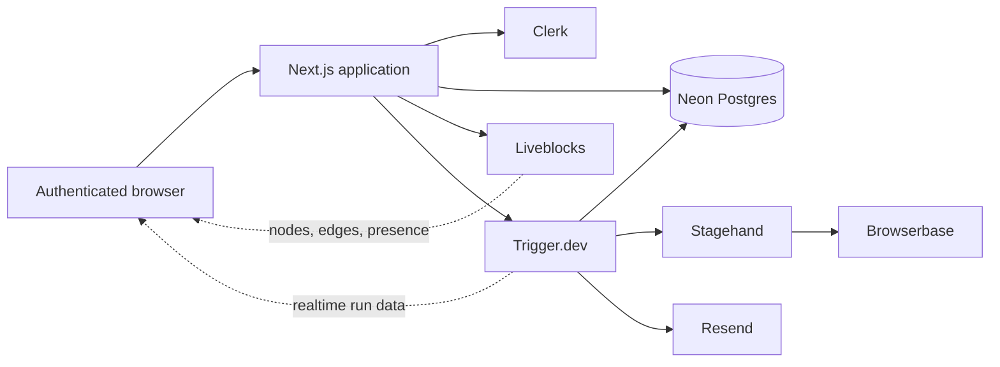
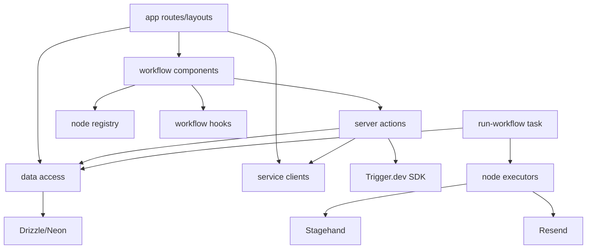

# Architecture

## Overview

The application is a feature-oriented Next.js 16 App Router system. Next.js
handles authenticated web requests and server-rendered composition; Liveblocks
owns the collaborative editing copy; Postgres stores the canonical graph used
for runs; Trigger.dev executes that graph; Browserbase and Stagehand perform
browser work; Clerk provides identity, organizations, and billing; Resend sends
email.

The standalone diagram source is
[`diagrams/architecture.mmd`](diagrams/architecture.mmd).

## Architectural Layers

| Layer | Modules | Responsibility |
| --- | --- | --- |
| Routing/composition | `app/`, `proxy.ts` | Route protection, layouts, pages, route handlers |
| Feature UI | `features/workflows/components/` | Canvas, palette/editor, logs, replay, run state |
| Application boundary | `features/workflows/actions.ts` | Authenticated mutations and task dispatch |
| Domain helpers | `features/workflows/lib/`, `nodes/node-registry.ts` | Graph rules, interpolation, node metadata |
| Data access | `features/workflows/data.ts` | Organization-scoped Drizzle queries |
| Persistence | `lib/db/` | Schema, connection, migrations |
| Background execution | `features/workflows/tasks/` | Durable graph execution and run metadata |
| Integrations | `lib/browserbase.ts`, `lib/liveblocks.ts`, `lib/resend.ts` | Server-side SDK clients |
| UI primitives | `components/ui/` | Generated/adapted reusable UI components |

## Feature-Based Architecture

The workflow capability is self-contained under `features/workflows/`: actions,
data access, components, hooks, pure helpers, node manifests/executors, and the
Trigger.dev task. Shared service clients and schema remain under `lib/`.

This structure keeps node-related behavior close together. A new action node is
added through an executor implementation, `node-executors.ts`, and
`node-registry.ts`; the canvas, inspector, and runner consume the registry.

## Dependency Direction

The main exception is `lib/db/schema.ts`, which imports the React Flow node type
to type the JSON graph. This couples persistence types to the workflow feature.

## Request Lifecycle

1. `proxy.ts` invokes Clerk middleware. Only sign-in, sign-up, and
   choose-organization are public.
2. A dashboard request renders the server `DashboardLayout`.
3. `AppSidebar` reads the active organization and queries its workflows.
4. A workflow page verifies the active organization, loads the tenant-scoped
   workflow, creates or updates its Liveblocks room, and mints a one-hour
   read-only Trigger.dev token scoped to tag `workflow:<id>`.
5. The server renders a client subtree containing Liveblocks, React Flow, and
   Trigger.dev realtime providers.
6. Liveblocks authenticates through `/api/liveblocks/auth` and synchronizes the
   graph and presence.

## Run Lifecycle

1. The client reads the current React Flow graph.
2. `validateGraph` checks for exactly one trigger, at least one edge, and no
   cycle.
3. `runWorkflowAction` repeats server-side validation through
   `saveWorkflowGraph`, enforces the Agent Pro gate, saves the graph, and
   triggers `run-workflow`.
4. The task loads the saved graph using both workflow and organization IDs.
5. It topologically orders connected nodes, skips unconnected nodes, and
   publishes step metadata.
6. A Stagehand Browserbase session is opened lazily and reused for browser
   nodes. Send Email does not open a browser.
7. Each node's fields are interpolated from prior outputs immediately before
   execution.
8. The task stops at the first error, closes Stagehand, and throws. Trigger.dev
   may retry the entire task according to global configuration.

## Rendering Strategy

Server Components are the default:

- root and dashboard layouts;
- dashboard, billing, auth, test, and workflow pages;
- `AppSidebar`;
- workflow shell composition.

Client Components are used for interactive or browser-dependent behavior:

- theme state;
- Liveblocks room and React Flow canvas;
- workflow palette/editor;
- realtime run subscription and console;
- HLS replay;
- workflow navigation and create button;
- route error boundary.

The workflow route is request-time dynamic because it reads Clerk auth and
tenant data. `loading.tsx` provides the route-level loading state. The client
room also uses `ClientSideSuspense`.

## Data Fetching and Caching

- Drizzle queries execute directly in Server Components, Server Actions, and
  the Trigger.dev task.
- No `use cache`, `unstable_cache`, tag cache, or explicit fetch cache is used.
- Workflow creation/deletion calls `revalidatePath("/workflows", "layout")`.
- The replay manifest response explicitly sends `Cache-Control: no-store`.
- Liveblocks and Trigger.dev data are realtime client subscriptions.

## Middleware

Next.js 16 uses `proxy.ts` for the Clerk middleware boundary. Its matcher covers
application routes and APIs while excluding Next.js internals and static files.

## Authentication and Authorization

Clerk authenticates the user and supplies the active organization. Tenant
authorization is enforced primarily by `org_id` filters in database queries and
organization-scoped Liveblocks groups. Clerk Billing's `has({ plan: "pro" })`
enforces premium behavior.

Known authorization gaps are documented in
[Authorization](AUTHORIZATION.md) and [Security Guide](SECURITY_GUIDE.md).

