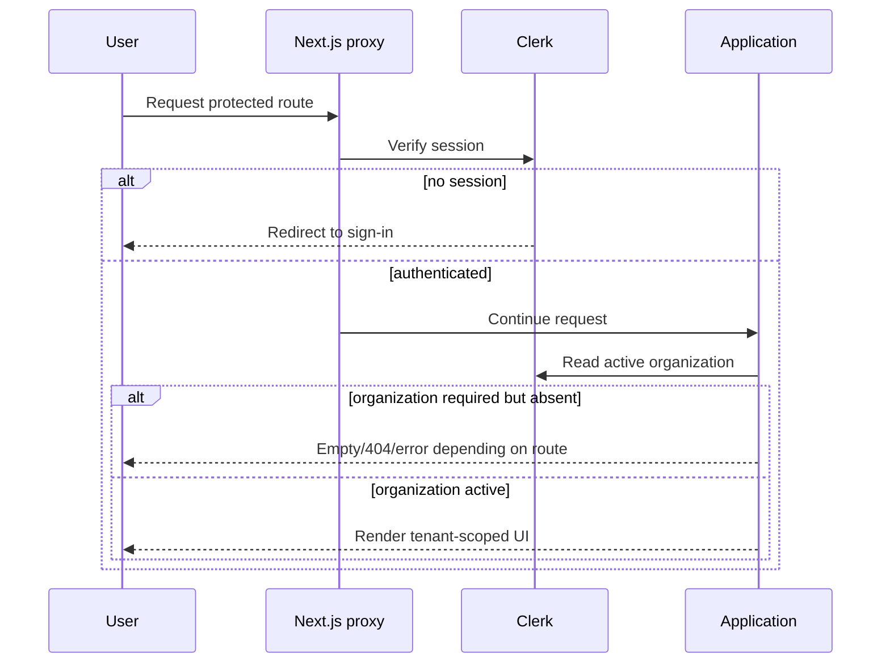

# Authentication

## Provider

Clerk supplies user sessions, authentication UI, current users, organizations,
and billing entitlements. The application does not implement passwords, session
storage, JWT signing, or OAuth callbacks itself.

## Route Protection

`proxy.ts` uses `clerkMiddleware` and protects all matched routes except:

- `/sign-in(.*)`
- `/sign-up(.*)`
- `/choose-organization(.*)`

The matcher excludes Next.js internals and common static file extensions, and
explicitly includes API routes.

## UI Flow



The root `ClerkProvider` maps Clerk's `choose-organization` task to
`/choose-organization`. The page renders `TaskChooseOrganization` and redirects
to `/` when complete.

The dashboard sidebar renders `OrganizationSwitcher` with personal accounts
hidden. Switching, creating, or leaving an organization redirects to `/`.

## Session Handling

Clerk manages session cookies and token verification. No application code reads
or sets Clerk cookie values directly. `auth()` is used in Server Components,
route handlers, and Server Actions; `useAuth()` is used for client plan checks.

The only application-managed cookie is `sidebar_state`, written by the UI
sidebar for seven days. It is a preference cookie and is not an authentication
credential.

## Liveblocks Authentication

The client uses `authEndpoint="/api/liveblocks/auth"`. The server calls
`identifyUser` with:

- Clerk `userId`;
- `groupIds: [orgId]`;
- `organizationId: orgId`;
- user name and avatar.

Workflow rooms grant `room:write` to the owning organization group and have no
default access.

## Trigger.dev Client Authentication

The workflow page mints a read-only public token with:

```ts
{
  read: {
    tags: [`workflow:${workflowId}`]
  }
}
```

The token expires after one hour and is passed to the client realtime hook. It
does not grant task triggering or cancellation; those operations use
authenticated Server Actions.

## Billing Authentication Context

Both client and server use Clerk's `has({ plan: "pro" })` for the active
organization. The server check is authoritative for Agent execution and replay
retrieval.

## Not Implemented

- Custom JWT issuance or validation.
- Custom session database.
- API keys for end users.
- Password reset or MFA UI outside Clerk's hosted/components flow.
- Impersonation controls in application UI.

