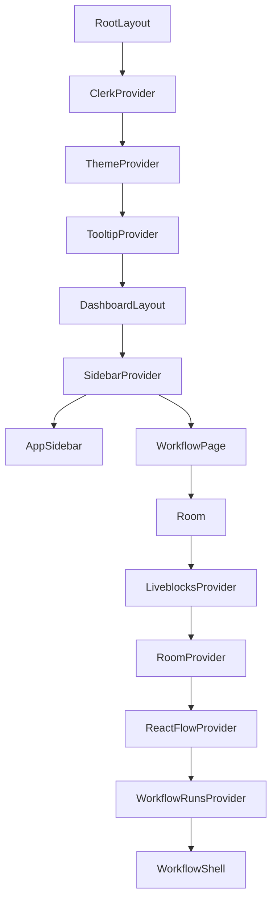

# Components

## Provider and Layout Hierarchy

## Root and Dashboard

### `RootLayout`

| Aspect | Details |
| --- | --- |
| Responsibility | Global HTML, fonts, Clerk, theme, tooltip, and toast providers |
| Props | `children` |
| State | None |
| Data source | None |
| Parent | Next.js root |
| Children | All routes |
| Rendering | Server Component composing provider client boundaries |

Geist and Geist Mono are loaded with `next/font`. Clerk uses the shadcn theme
and maps the organization task URL.

### `DashboardLayout`

Composes `SidebarProvider`, `AppSidebar`, and `SidebarInset` in a viewport-height
shell. It is a Server Component.

### `AppSidebar`

| Aspect | Details |
| --- | --- |
| Responsibility | Organization switcher, workflow list, collapse control, user menu |
| Props | `Sidebar` props |
| State | Sidebar state lives in `SidebarProvider` |
| Data source | Clerk `auth()` and `listWorkflows(orgId)` |
| Parent | `DashboardLayout` |
| Children | `WorkflowNav`, Clerk `OrganizationSwitcher`, `UserButton` |
| Rendering | Async Server Component |

The local sidebar primitive hardcodes `isMobile = false`, so its mobile sheet is
not used.

### `ThemeProvider`

Wraps `next-themes` with system-default class mode. A document-level `d` key
toggles light/dark unless the user is typing. It does not show visible shortcut
instructions.

## Workflow Route Composition

### Workflow page

`app/(dashboard)/workflows/[id]/page.tsx`:

- resolves promise-based Next.js 16 params;
- requires an active organization;
- loads the tenant-scoped workflow or calls `notFound()`;
- creates the private Liveblocks room;
- mints a one-hour read-only Trigger.dev token;
- wraps the editor in Liveblocks, React Flow, and run providers.

### `Room`

| Props | `roomId`, `children` |
| --- | --- |
| Responsibility | Liveblocks client/provider setup and Suspense fallback |
| Data source | `/api/liveblocks/auth`, `/api/liveblocks/users` |
| State | Liveblocks connection/storage/presence |
| Rendering | Client Component |

User resolution catches fetch failures and returns `undefined`, leaving
Liveblocks to degrade without display metadata.

### `WorkflowRunsProvider`

Opens one `useRealtimeRunsWithTag` subscription for `workflow:<id>` and exposes:

- latest steps and live state;
- first live run;
- all console runs newest-first;
- final Browserbase session ID.

It prefers final task output for successful runs and falls back to live metadata
for active or failed runs.

### `WorkflowShell`

Composes a horizontal resizable editor:

- left: vertical canvas and console;
- right: toolbar/editor sidebar.

The current implementation wraps `RightSidebar` in a `ResizablePanel` while
`RightSidebar` itself also returns a `ResizablePanel`. This duplicated panel
boundary is technical debt.

## Canvas and Nodes

### `Canvas`

| Aspect | Details |
| --- | --- |
| Responsibility | Collaborative React Flow rendering |
| Props | None |
| State | Liveblocks nodes/edges; React Flow viewport/selection |
| Initial data | One Start node and no edges for a new room |
| Children | Controls, Liveblocks cursors, avatar stack, `StepNode` |
| Rendering | Client-only behavior behind room Suspense |

Theme color mode is held at `light` through SSR/hydration and switches after
mount. Edges use smooth-step rendering, maximum zoom is `1`, and `fitView` runs
on initialization.

### `StepNode`

Renders registry icon/accent, title, populated field values, and React Flow
handles. Trigger nodes omit the target handle. It reads the latest run to show a
spinner while running and a destructive border after failure.

### `NodeIcon`

Small reusable registry icon chip. It can swap the icon for a spinner.

## Right Sidebar

### `RightSidebar`

| Aspect | Details |
| --- | --- |
| Responsibility | Workflow actions, node palette, selected-node editor |
| Props | `workflowId` |
| State | Active tab, prior selected node ID |
| Data source | React Flow store, plan hook, run provider |
| Children | Actions menu, Run/Stop button, Palette, Inspector |
| Rendering | Client Component |

Selection changes switch the tab to Editor through a guarded state update during
render. Comments marked TODO no longer match the implemented selection lookup.

### Palette

- Groups registry entries into Triggers and Actions.
- Adds nodes at the center of the current viewport.
- Prevents a second Start trigger.
- Numbers duplicate node types.
- Locks Agent for loaded, non-Pro organizations.

### Inspector

Renders registry-defined inputs/textareas for the selected node. Field changes
call `updateNodeData`. Upstream output chips append interpolation tokens to the
last focused field, or the first field by default.

### Run/Stop

Run reads current nodes/edges, performs client validation, and calls the run
Server Action. Stop calls cancellation for the live run and catches errors with
a toast.

## Console

### `ConsolePanel`

Owns selected step/replay state. It renders logs alone or a resizable logs and
inspector split. Selecting the active row again clears it.

### `LogsPanel`

Renders runs newest-first with local time, lowercase Trigger.dev status, step
icons, timing, failure color, and pending opacity. A replay row appears only
after a session ID exists and the run is no longer live.

### `InspectorPanel`

Re-reads shared run data for the selected item. It renders:

- replay video;
- step error text;
- pretty-printed JSON output;
- pending/running/no-output states.

### `SessionReplay`

Polls the server route every two seconds until it stops returning `202`, then
uses hls.js or native HLS. It cleans up timers and hls.js on unmount.

## Navigation and Route States

- `WorkflowNav`: responsive-to-collapse workflow navigation and creation.
- `NewWorkflowButton`: transition-backed create action on the dashboard empty
  state.
- `loading.tsx`: centered spinner.
- `error.tsx`: client reset boundary showing the error message.
- `not-found.tsx`: workflow missing/deleted empty state.
- Auth pages: centered Clerk `SignIn`, `SignUp`, and organization task.
- Billing page: Clerk organization `PricingTable`.
- Test page: server auth smoke route.

## UI Primitives

`components/ui/` is a local shadcn/Base UI/Radix primitive library. Product code
directly depends on accordion, button, dropdown menu, empty state, input, label,
popover, resizable panels, sidebar, spinner, tabs, textarea, toaster, and
tooltip. Other checked-in primitives are currently unused by product features
but remain source-owned and linted.

