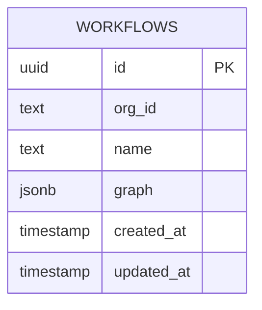

# Database

## Overview

The application uses Neon Serverless Postgres through Drizzle ORM's Neon HTTP
driver. The schema source is `lib/db/schema.ts`; migrations are in
`lib/db/migrations/`.

Runtime queries use `DATABASE_URL`. Drizzle migration commands prefer
`DATABASE_URL_UNPOOLED` and fall back to `DATABASE_URL`.

## Entity Relationship Diagram



The standalone source is [`diagrams/database.mmd`](diagrams/database.mmd).

## `workflows`

| Column | Database type | Null | Default | Meaning |
| --- | --- | --- | --- | --- |
| `id` | `uuid` | No | `gen_random_uuid()` | Workflow and Liveblocks room ID |
| `org_id` | `text` | No | None | Clerk organization owner |
| `name` | `text` | No | None | Generated workflow display name |
| `graph` | `jsonb` | Yes | `NULL` | Canonical run snapshot |
| `created_at` | `timestamp` | No | `now()` | Creation time |
| `updated_at` | `timestamp` | No | `now()` | Last graph save time |

The exported row type is:

```ts
export type Workflow = typeof workflows.$inferSelect
```

### Graph JSON Shape

```ts
type WorkflowGraph = {
  nodes: StepNodeType[]
  edges: Edge[]
}
```

The JSON mirrors React Flow node and edge structures. Node field values are
strings. Runtime output is not stored in the table.

## Relationships

There are no database foreign keys. `org_id` refers conceptually to a Clerk
organization, and `id` refers conceptually to:

- a Liveblocks room ID;
- the `workflow:<id>` Trigger.dev tag.

Those relationships cross external systems and are enforced in application
code, not by Postgres.

## Indexes and Constraints

- Primary key on `id`.
- `NOT NULL` on `org_id`, `name`, `created_at`, and `updated_at`.
- No secondary indexes.
- No unique constraints other than the primary key.
- No check constraints.
- No foreign keys.
- No database enums.

The workflow list filters by `org_id` and orders by `created_at DESC`; adding an
index such as `(org_id, created_at DESC)` is a documented improvement.

## Migrations

One migration exists:

| Migration | Purpose |
| --- | --- |
| `0000_third_reaper.sql` | Creates `workflows` |

Drizzle metadata uses schema snapshot version 7 and PostgreSQL dialect.

## ORM Usage

`features/workflows/data.ts` defines all current queries:

- list workflows by organization;
- fetch one workflow by organization and ID;
- create a workflow;
- update a graph and `updated_at`;
- delete by organization and ID.

Organization predicates are included in fetch, update, and delete operations.
SQL injection is mitigated by Drizzle's parameterized query builder.

## Data Lifecycle

1. Creation inserts an ID, organization, and name; `graph` remains null.
2. Liveblocks owns edits until Run.
3. Run validates and writes the entire graph JSON snapshot.
4. Trigger.dev reads that snapshot.
5. Delete removes the row, then attempts to delete the matching Liveblocks room.

There is no database transaction spanning Postgres and Liveblocks.

## Not Implemented

- Database-backed users, organizations, roles, subscriptions, or sessions.
- Workflow revisions or audit history.
- Run, step, output, or replay tables.
- Soft delete or archival.
- Automatic `updated_at` database trigger.
- Row-level security.
- Seed scripts.

