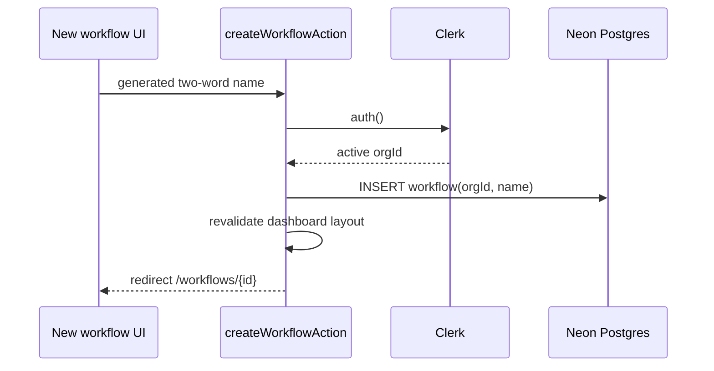
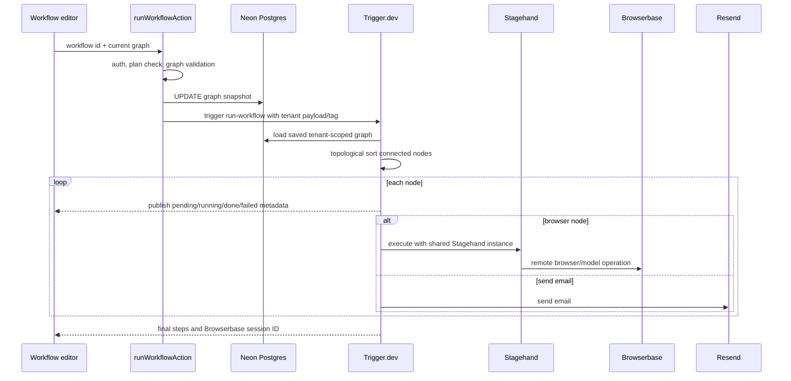

# Data Flow

## Workflow Creation



The graph is null after creation.

## Editing

1. The workflow page loads the database row with an organization predicate.
2. The page creates/updates a private Liveblocks room using the workflow ID.
3. `Room` authenticates the client through the Liveblocks auth route.
4. `useLiveblocksFlow` initializes a Start node for a new room and synchronizes
   nodes and edges.
5. React Flow selection/viewport state stays client-side.
6. Node field updates mutate React Flow/Liveblocks state.

Postgres is not updated during editing.

## Output Connections

`useUpstreamConnections` traverses all incoming ancestors breadth-first.
Registry output definitions become insertable tokens:

```text
{{ node-id.output.path }}
```

At run time, `interpolate` resolves dotted and bracket paths from already
completed node outputs. Missing/null values become an empty string; object and
array values become JSON text.

## Run



Source: [`diagrams/sequence.mmd`](diagrams/sequence.mmd).

## Replay

1. Successful run output exposes `browserbaseSessionId`.
2. Pro user selects Replay.
3. `SessionReplay` polls `/api/replays/{sessionId}` every two seconds.
4. The route returns `202` until Browserbase exposes replay pages.
5. The route proxies the first page's HLS playlist with `no-store`.
6. hls.js loads the route URL; Safari can use native HLS.

## Deletion

1. Delete action verifies an active organization.
2. Database deletion includes organization and workflow IDs.
3. If a row was deleted, the action deletes the same ID from Liveblocks.
4. The dashboard layout is revalidated and the user is redirected home.

If Liveblocks deletion fails, the database row is already gone.

## Data Stores

| Data | Store |
| --- | --- |
| User/session/org/plan | Clerk |
| Workflow identity/name/run snapshot | Postgres |
| Editable graph and presence | Liveblocks |
| Run status, metadata, output | Trigger.dev |
| Browser state and recording | Browserbase |
| Email delivery record | Resend |

